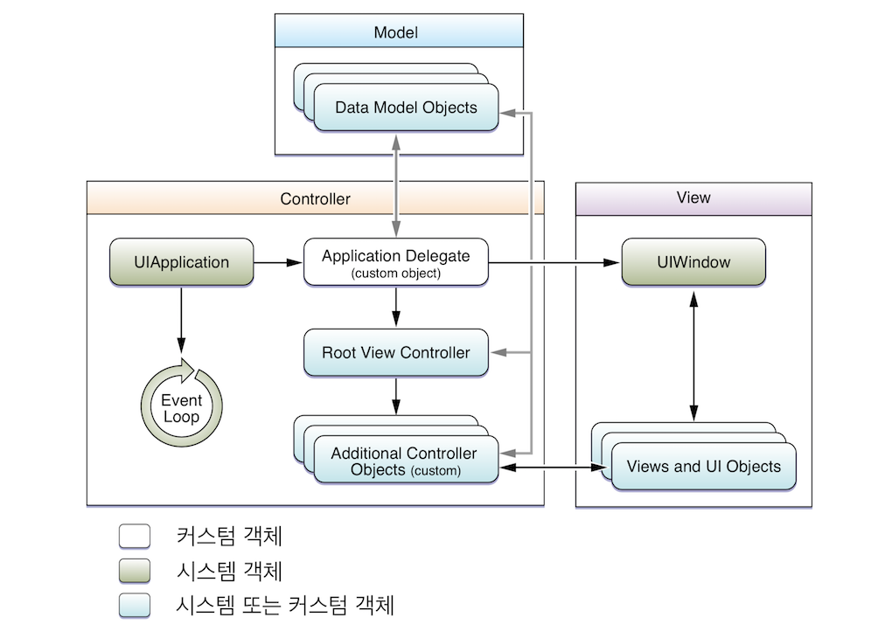
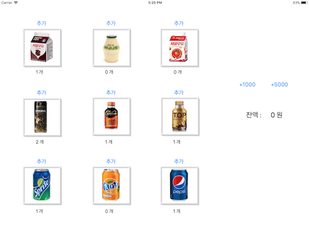

# 음료 자판기 앱

## Step1 (시작하기 - 아이패드 앱)
### 요구사항
- 음료 자판기 앱 프로젝트 저장소를 본인 저장소로 fork하고 로컬에 clone한다.
- iOS 프로젝트 Single View App 템플릿으로 하고 프로젝트 이름을 "VendingMachineApp"으로 지정하고, 위에 만든 로컬 저장소 경로에 생성한다.
- 프로젝트에 대한 일반 설정 (General)에서 Devices 항목을 iPad로 변경하고, Device Orientation 항목을 가로 (Landscape Left, Landscape Right)만 선택한다.
- 기본 상태로 아이패드 프로 10.5 시뮬레이터를 골라서 실행한다.
- iOS 앱 프로젝트 기본 구조인 MVC 형태에 맞춰서 기존 레벨2에서 작성한 자판기 소스 파일을 적용한다.
- readme.md 파일을 자신의 프로젝트에 대한 설명으로 변경한다.
    + 단계별로 미션을 해결하고 리뷰를 받고나면 readme.md 파일에 주요 작업 내용(바뀐 화면 이미지, 핵심 기능 설명)과 완성 날짜시간을 기록한다.
    + 실행한 화면을 캡처해서 readme.md 파일에 포함한다.

### 프로그래밍 요구사항
- 레벨2 VendingMachine 미션의 Main, InputView, OutputView를 제외하고 전체 클래스를 프로젝트로 복사한다.
- 기존 코드들은 MVC 중에서 대부분 Model의 역할을 담당한다.
- iOS 앱 구조는 MVC 중에서도 우선 ViewController-Model 사이 관계에 집중하고, ViewController-View 관계는 다음 단계에서 개선한다.
- ViewController 클래스에 VendingMachine 객체를 변수로 추가하고 viewDidLoad() 함수에서 음료수 객체 3종류를 추가하고 재고 목록을 print() 한다.

- 콘솔 화면
```
딸기우유(2개) 바나나우유(1개) 팹시콜라(3개)
```

### 결과
#### Console
```
죠지아커피 3000원(1개) 딸기우유 1000원(1개) 펩시콜라 2000원(1개)
```

---
## Step2 (MVC 패턴)
### 요구사항
- iOS 앱 프로젝트 기본 구조인 MVC 형태에 맞춰서 기존 레벨2에서 작성한 자판기 소스 파일을 적용한다.

- iOS 프로젝트와 앱을 구성 핵심 요소들을 MVC로 구분하면 다음과 같다.

    + 레벨2 자판기에서 View에 해당하는 InputView와 OutputView는 스토리보드나 코드로 작성하는 화면요소로 대체한다.
    + 이제 특별한 요구사항이 없을 경우 print() 함수로 출력하는 경우는 지양한다.
실행하고 새로운 화면을 캡처해서 readme.md 파일에 포함한다.

### 프로그래밍 요구사항
- 스토리보드에 다음과 같이 아이패드 앱 화면을 구현한다.

    + 각 상품에 대한 재고 추가 버튼을 추가한다.
    + 각 상품에 대한 이미지를 추가한다.
    + 각 상품에 대한 재고 레이블을 추가한다.
    + 1000원, 5000원 금액을 입력하는 버튼을 추가한다.
    + 현재 잔액을 표시할 레이블을 추가한다.
- 각 상품의 재고 추가 버튼을 누르면 각 상품 재고를 추가하도록 코드를 구현한다.
- 재고 추가 버튼을 누르고 나면 전체 레이블을 다시 표시한다.
- 금액 입력 버튼을 누르면 해당 금액을 추가하도록 코드를 구현한다.
- 금액을 추가하고 나면 잔액 레이블을 다시 표시한다.

### 결과
#### UI



